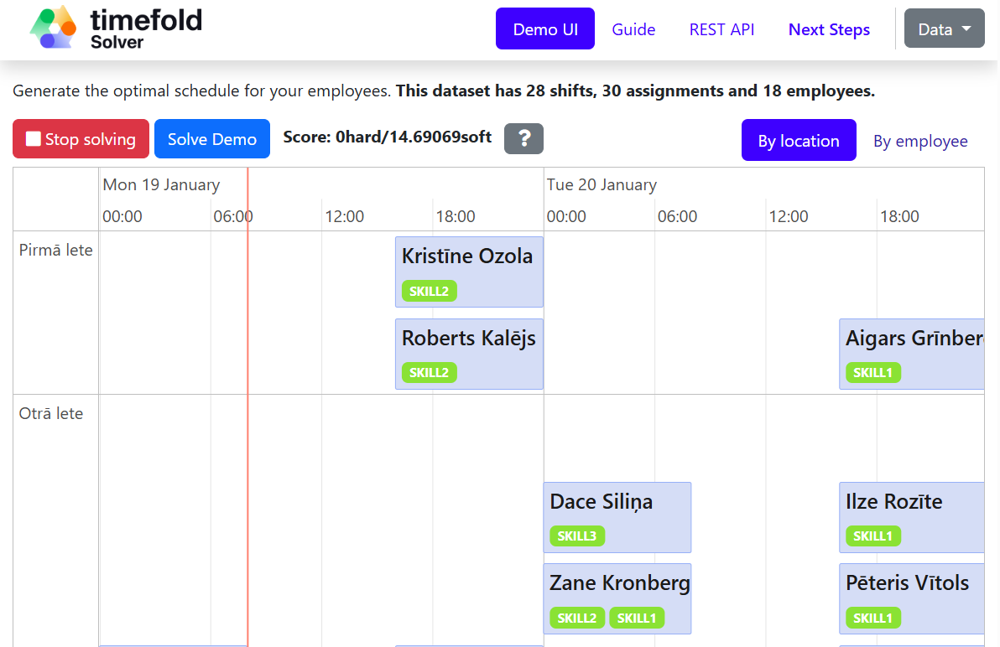

# Employee Scheduling Optimization



Employee shift scheduling system with constraint-based optimization, comparing Late Acceptance Hill Climbing and Tabu Search algorithms.

## Quick Start

### Prerequisites
- Java 17+
- Maven 3.8.6+
- (Optional) Docker

### Run Application

```sh
mvn quarkus:dev
```

Open in browser: [http://localhost:8081](http://localhost:8081)

## Features

### Optimization Algorithms

Two metaheuristic algorithms with configurable selection via `application.properties`:

1. **Late Acceptance Hill Climbing** (`solverConfig.xml` or `solverConfigLateAcceptance.xml`)
   - Parameter: `lateAcceptanceSize = 400`
   - Best for: Stable, consistent results on balanced datasets
   
2. **Tabu Search** (`solverConfigTabu.xml`)
   - Parameter: `entityTabuSize = 7`
   - Best for: Higher quality solutions, better exploration

**Switch algorithms:**
```properties
# application.properties
quarkus.timefold.solver-config-xml=solverConfig.xml          # Late Acceptance
quarkus.timefold.solver-config-xml=solverConfigTabu.xml      # Tabu Search
```

### Constraints

**Hard Constraints** (must be satisfied):
- One shift per employee per day
- Employee has required skills for shift
- No work during vacation
- No work during sick leave
- Every shift must be covered

**Soft Constraints** (optimized):
- Balance workload across employees
- Match employee time preferences (+1 bonus / -1 penalty)
- Limit night shifts (after 22:00) to max 8/month

## Benchmarking

Compare algorithm performance across different dataset sizes.

### Run Benchmarks

```sh
mvn clean compile -Dmaven.test.skip=true
mvn exec:java -Dexec.mainClass="org.acme.employeescheduling.rest.BenchmarkRunner"
```

**Duration:** ~5-10 minutes (2 algorithms × 3 datasets × 3 runs × 30s each)

### View Results

Results are saved to `target/benchmarks/[timestamp]/index.html`. Open in browser to see:
- Best score comparison charts
- Performance statistics
- Algorithm convergence graphs

### Test Datasets

- **SMALL:** 5 employees, 9 shifts (3 days) - Quick validation
- **MEDIUM:** 20 employees, 75 shifts (5 days) - Realistic scenario
- **LARGE:** 50 employees, 210 shifts (7 days) - Stress test

### Understanding Results

**Score format:** `Xhard/Ysoft`
- **Hard score (X):** Must be 0 (all mandatory constraints satisfied)
- **Soft score (Y):** Higher is better (quality of solution)

**Expected outcomes:**
- Late Acceptance: Consistent, stable performance
- Tabu Search: Better exploration, higher quality solutions long-term

## Docker Deployment

```sh
docker build -t employee-scheduling:latest .
docker run -p 8081:8081 employee-scheduling:latest
```

Access at [http://localhost:8081](http://localhost:8081)

See [DOCKER_GUIDE.md](DOCKER_GUIDE.md) for publishing to DockerHub.

## Project Structure

```
src/main/
├── java/org/acme/employeescheduling/
│   ├── domain/              # Domain model (Employee, Shift, etc.)
│   ├── solver/              # Constraints and scoring rules
│   └── rest/                # REST endpoints, data generation, benchmarking
├── resources/
│   ├── application.properties
│   ├── solverConfig.xml               # Late Acceptance (default)
│   ├── solverConfigTabu.xml           # Tabu Search
│   └── benchmarkConfig.xml            # Benchmark configuration
```

## Technology Stack

- **Java:** 17 (OpenJDK)
- **Framework:** Quarkus 3.30.2
- **Solver:** Timefold Solver 1.29.0 Community Edition
- **Build:** Maven 3.9.8
- **Deployment:** Docker

## Additional Documentation

- [DOCKER_GUIDE.md](DOCKER_GUIDE.md) - Docker deployment guide
- [test-data/](test-data/) - Test dataset specifications

## Team Contributions

**Paula:** Domain model, frontend UI, hard constraints, REST API, base solver configuration, documentation  
**Jevgenijs:** Soft constraints, algorithm configurations, benchmarking, Docker setup, documentation

---

**Repository:** https://github.com/p-beatrise/PKOPT_lielais_darbs  
**Docker Image:** https://hub.docker.com/r/de1ran/employee-scheduling  
**Course:** Practical Combinatorial Optimization, University of Latvia
